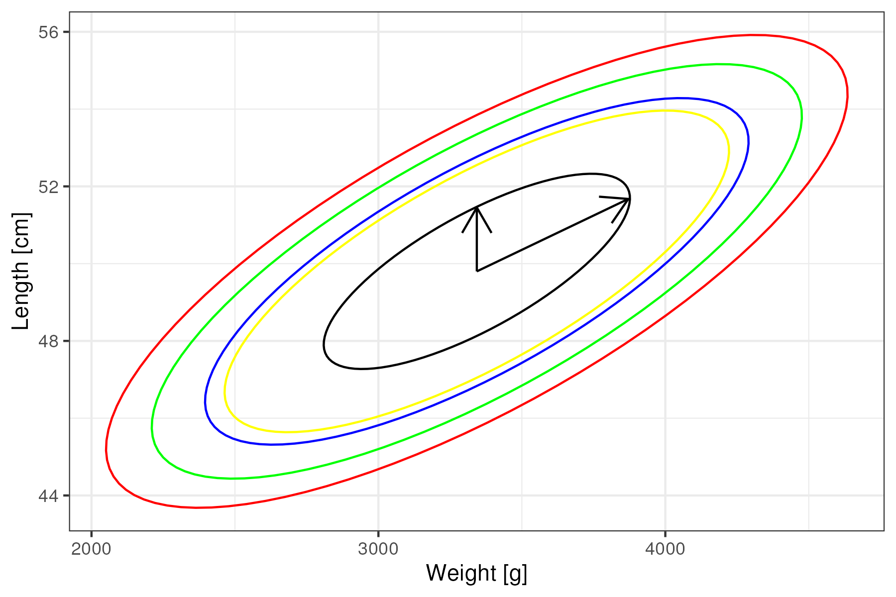

# Report 1 by Paweł Grabiński
## Vector and Matrix Algebra, Multivariate Normal Distribution

## Exercises
### Exercise 1
Consider the matrix
$$A = \begin{bmatrix} 3 & -1 \\ -1 & 3 \end{bmatrix}$$

#### 1. Is $A$ symmetric?
For a matrix to be symmetric, it must be equal to its transpose.
$$A^T = \begin{bmatrix} 3 & -1 \\ -1 & 3 \end{bmatrix}$$
Thus, $A=A^T$ and $A$ is symmetric.

#### 2. and 3. Perform the spectral decomposition of $A$.
To obtain the spectral decomposition we have to find the eigenvalues and eigenvectors of $A$. To do so, we have to solve the following equation:
$$\det(A-\lambda I) = 0$$
In this case:
$$\det\begin{bmatrix} 3-\lambda & -1 \\ -1 & 3-\lambda \end{bmatrix} = 0$$
That is:
$$\det\begin{bmatrix} 3-\lambda & -1 \\ -1 & 3-\lambda \end{bmatrix} =(3-\lambda)^2 - 1 = 8 - 6\lambda + \lambda^2=(\lambda-4)(\lambda-2)=0$$
The eigenvalues are $\lambda_1=4$ and $\lambda_2=2$. To find the eigenvectors, we have to solve the following equations:
$$A\mathbf{v}_i = \lambda_i\mathbf{v}_i$$
For $\lambda_1=4$:
$$\begin{bmatrix} 3 & -1 \\ -1 & 3 \end{bmatrix}\begin{bmatrix} v_{11} \\ v_{12} \end{bmatrix} = \begin{bmatrix} 3v_{11} - v_{12}\\ -v_{11} + 3v_{12} \end{bmatrix} = 4\begin{bmatrix} v_{11} \\ v_{12} \end{bmatrix}$$
We get the following equations:
$$3v_{11} - v_{12} = 4v_{11}\\-v_{11} + 3 v_{12} =4v_{12}$$
That gets us:
$$v_{11} = -v_{12}\\ -v_{11}=v_{12}$$
As these equations are equivalent, we can choose $v_{11}=2^{-\frac{1}{2}}$ and $v_{12}=-2^{-\frac{1}{2}}$ for normalization purpose. Thus, the eigenvector corresponding to $\lambda_1=4$ is $\mathbf{v}_1 = \begin{bmatrix} 2^{-\frac{1}{2}} \\ -2^{-\frac{1}{2}} \end{bmatrix}$.

For $\lambda_2=2$:
$$\begin{bmatrix} 3 & -1 \\ -1 & 3 \end{bmatrix}\begin{bmatrix} v_{21} \\ v_{22} \end{bmatrix} = \begin{bmatrix} 3v_{21} - v_{22}\\ -v_{21} + 3v_{22} \end{bmatrix} = 2\begin{bmatrix} v_{21} \\ v_{22} \end{bmatrix}$$
We get the following equations:
$$3v_{21} - v_{22} = 2v_{21}\\-v_{21} + 3 v_{22} =2v_{22}$$
Simplifying, we get:
$$v_{21} = v_{22}\\ v_{21}=v_{22}$$
Analogically, for normalization we pick $v_{21}=2^{-\frac{1}{2}}$ and $v_{22}=2^{-\frac{1}{2}}$. Thus, the eigenvector corresponding to $\lambda_2=2$ is $\mathbf{v}_2 = \begin{bmatrix} 2^{-\frac{1}{2}} \\ 2^{-\frac{1}{2}} \end{bmatrix}$.

The spectral decomposition of $A$ is:
$$\lambda_1v_1v_1^T+\lambda_2v_2v_2^T=4\begin{bmatrix} 2^{-\frac{1}{2}} \\ -2^{-\frac{1}{2}} \end{bmatrix}\begin{bmatrix} 2^{-\frac{1}{2}} & -2^{-\frac{1}{2}} \end{bmatrix} + 2\begin{bmatrix} 2^{-\frac{1}{2}} \\ 2^{-\frac{1}{2}} \end{bmatrix}\begin{bmatrix} 2^{-\frac{1}{2}} & 2^{-\frac{1}{2}} \end{bmatrix}\\
=4\begin{bmatrix} 2^{-1} & -2^{-1} \\ -2^{-1} & 2^{-1} \end{bmatrix} + 2 \begin{bmatrix} 2^{-1} & 2^{-1} \\ 2^{-1} & 2^{-1}\end{bmatrix}\\
=\begin{bmatrix} 2 & -2 \\ -2 & 2 \end{bmatrix} +  \begin{bmatrix} 1 & 1 \\ 1 & 1\end{bmatrix}=\begin{bmatrix} 3 & -1 \\ -1 & 3 \end{bmatrix}=A$$

#### 4. Use the spectral decomposition of A given above and find $\sqrt{A}$. Check that the matrix you found satisfies: $\sqrt{A}\sqrt{A}=A$.

To find $\sqrt{A}$, we can use the spectral decomposition of $A$:
$$A = \left[v_1, v_2\right] \begin{bmatrix} \lambda_1 & 0 \\ 0 & \lambda_2 \end{bmatrix} \left[v_1, v_2\right]^T$$
The square root of $A$ will be:
$$\sqrt{A} = \left[v_1, v_2\right] \begin{bmatrix} \sqrt{\lambda_1} & 0 \\ 0 & \sqrt{\lambda_2} \end{bmatrix} \left[v_1, v_2\right]^T$$
In our case it is:
$$\sqrt{A} = \begin{bmatrix} 2^{-\frac{1}{2}} & 2^{-\frac{1}{2}} \\ -2^{-\frac{1}{2}} & 2^{-\frac{1}{2}} \end{bmatrix} \begin{bmatrix} 2 & 0 \\ 0 & \sqrt{2} \end{bmatrix} \begin{bmatrix} 2^{-\frac{1}{2}} & 2^{-\frac{1}{2}} \\ -2^{-\frac{1}{2}} & 2^{-\frac{1}{2}} \end{bmatrix}^T\\
=\begin{bmatrix} 2^{-\frac{1}{2}} & 2^{-\frac{1}{2}} \\ -2^{-\frac{1}{2}} & 2^{-\frac{1}{2}} \end{bmatrix} \begin{bmatrix} 2 & 0 \\ 0 & \sqrt{2} \end{bmatrix} \begin{bmatrix} 2^{-\frac{1}{2}} & -2^{-\frac{1}{2}} \\ 2^{-\frac{1}{2}} & 2^{-\frac{1}{2}} \end{bmatrix}\\
=\begin{bmatrix} 2^{-\frac{1}{2}} & 2^{-\frac{1}{2}} \\ -2^{-\frac{1}{2}} & 2^{-\frac{1}{2}} \end{bmatrix}  \begin{bmatrix} 2^{\frac{1}{2}} & -2^{\frac{1}{2}} \\ 1 & 1 \end{bmatrix}\\
=\begin{bmatrix} 1+2^{-\frac{1}{2}} & -1 + 2^{-\frac{1}{2}} \\ -1+2^{-\frac{1}{2}} & 1 + 2^{-\frac{1}{2}} \end{bmatrix}$$

We can check if $\sqrt{A}\sqrt{A}=A$:
$$\sqrt{A}\sqrt{A} = \begin{bmatrix} 1+2^{-\frac{1}{2}} & -1 + 2^{-\frac{1}{2}} \\ -1+2^{-\frac{1}{2}} & 1 + 2^{-\frac{1}{2}} \end{bmatrix}\begin{bmatrix} 1+2^{-\frac{1}{2}} & -1 + 2^{-\frac{1}{2}} \\ -1+2^{-\frac{1}{2}} & 1 + 2^{-\frac{1}{2}} \end{bmatrix}\\
=\begin{bmatrix} (1+2^{-\frac{1}{2}})^2 + (-1+2^{-\frac{1}{2}})^2 & 2(-1 + 2^{-\frac{1}{2}})(1+2^{-\frac{1}{2}}) \\ 2(-1 + 2^{-\frac{1}{2}})(1+2^{-\frac{1}{2}}) & (-1+2^{-\frac{1}{2}})^2 + (1+2^{-\frac{1}{2}})^2 \end{bmatrix}\\
=\begin{bmatrix} 1+2\cdot 2^{-\frac{1}{2}} + 2^{-1} + 1 - 2\cdot 2^{-\frac{1}{2}} + 2^{-1} & 2(2^{-1}-1) \\ 2(2^{-1}-1) & 1+2\cdot 2^{-\frac{1}{2}} + 2^{-1} + 1 - 2\cdot 2^{-\frac{1}{2}} + 2^{-1} \end{bmatrix}\\
=\begin{bmatrix} 3 & -1 \\ -1 & 3 \end{bmatrix}=A$$

### Exercsise 2

Consider the spectral decomposition of a positive definite matrix as given in
Lecture 1:
$$A = P\Lambda P^T.$$
The columns of $P$ are made of eigenvectors $e_i$, $i = 1, . . . , n$ and they are orthonormalized, i.e. their lengths are one and they are orthogonal (peripendicular) one to another. The diagonal matrix $\Lambda$ has the corresponding (positive) eigenvalues on the diagonal. Provide argument for the following:
#### 1. $P^T = P^{-1}$

Now, by the definition of the inverse matrix, we have:
$$P^{-1}P = I,$$
where $I$ is the identity matrix. 

Similarly, we can consider:
$$(P^TP)_{km} = \sum_{i=1}^{n}(e_k^T)_i(e_m)_i = e_k^Te_m.$$

By the orthonormality we have that:
$$e_i^Te_j = \delta_{ij}.$$

That gives us:
$$(P^TP)_{km} = e_k^Te_m = \delta_{km}.$$

And in the matrix form:
$$P^TP = I.$$

Then we have:
$$P^TP -  P^{-1}P = 0\\
(P^T-P^{-1})P=0$$

As $P$ is non-singular, we can multiply both sides by $P^{-1}$:
$$P^T-P^{-1}=0\\
P^T=P^{-1}$$

#### 2. Determinant of $\Lambda$ is the product of the terms on the diagonal.

We can show that by induction. Let's consider diagonal square matrices $A^{(k)}$ where $k$ is the number of dimensions and their entries are positive.

For $n=1$ according to the lecture notes:
$$\det(A)=a_{11}=\prod_{i=1}^{1}a_{ii}$$

For $n>1$, we assume that $\det(A^{(n)})=\prod_{i=1}^{n}a_{ii}$. We can consider the matrix $A^{(n+1)}$ with the formula from the lecture:
$$\det(A^{(n+1)}) = \sum_{j}^k a_{1j}(-1)^{1+j}\det(A_{1j}),$$
where $A_{1j}$ is the matrix obtained if row $1$ and column $j$ are
deleted.

As the matrix $A^{(n+1)}$ is diagonal, the only non-zero element is $a_{11}$. Thus, the determinant is:

$$\det(A^{(n+1)}) = a_{11}(-1)^{1+1}\det(A_{11}) = a_{11}\det(A_{11}) $$

Now, we removed the row and column with indices $1$, so the matrix $A_{11}$ is diagonal and belongs the our family of matrices. It can be denoted as $A^{(n)}$ (with its entries being entries of the original $A^{(n+1)}$ matrix with indices starting from $2$ going to $n+1$) Thus, we can write:

$$\det(A^{(n+1)}) = a_{11}\det(A_{11}) = a_{11}\prod_{i=2}^{n+1}a_{ii} = \prod_{i=1}^{n+1}a_{ii}$$

As we have shown that the formula holds for $n=1$ and that if it holds for $n$ it holds for $n+1$, we have shown that the formula holds for all $n$.

#### 3. Determinat of $A$ is the same as that of $\Lambda$.

We can consider the determinants through the spectral decomposition of $A$:
$$\det(A) = \det(P\Lambda P^T)=\det(P)\det(\Lambda)\det(P^T)=\det(\Lambda)\det(P)\det(P^T)=\det(\Lambda)\det(PP^T).$$

Where we used the property of the determinant that $\det(AB)=\det(A)\det(B)$ from the lecture notes and the fact that determinants are scalars so their multiplication is commutative.

As we have shown in the previous point that $P^T=P^{-1}$, we have:
$$\det(A) = \det(\Lambda)\det(PP^T)=\det(\Lambda)\det(I)=\det(\Lambda).$$

#### 4. Find the inverse of $\Lambda$, i.e. $\Lambda^{-1}$.
Since the eigenvalues $\lambda_i$ are positive, we can define the matrix $B$ as:
$$B =\text{diag}\left(\frac{1}{\lambda_1},\dots,\frac{1}{\lambda_n}\right)$$
Then, we can consider the product of $\Lambda$ and $B$:
$$\Lambda B=\text{diag}\left(\lambda_1,\dots,\lambda_n\right)\text{diag}\left(\frac{1}{\lambda_1},\dots,\frac{1}{\lambda_n}\right)=\text{diag}\left(\frac{\lambda_1}{\lambda_1},\dots,\frac{\lambda_n}{\lambda_n}\right)=\text{diag}\left(1,\dots,1\right)=I$$

By the definition of the inverse matrix, we have:
that $B=\Lambda^{-1}$.

#### 5. A simple way to determine the inverse of a matrix $A$ from its spectral decomposition is through
$$A^{-1} = P\Lambda^{-1}P^T.$$
Verify that the right hand side of the above indeed define the inverse of $A$.

Let's consider the product of $A$ and $A^{-1}$:
$$A^{-1}A = P\Lambda^{-1}P^TP\Lambda P^T = P\Lambda^{-1}I\Lambda P^T = P\Lambda^{-1}\Lambda P^T = PIP^T = I$$

#### 6. Check all these statements on the little example of Exercise 1.

1. $P^T = \begin{bmatrix} 2^{-\frac{1}{2}} & 2^{-\frac{1}{2}} \\ -2^{-\frac{1}{2}} & 2^{-\frac{1}{2}} \end{bmatrix}^T=\begin{bmatrix} 2^{-\frac{1}{2}} & -2^{-\frac{1}{2}} \\ 2^{-\frac{1}{2}} & 2^{-\frac{1}{2}} \end{bmatrix}\\P^{-1} = \begin{bmatrix} 2^{-\frac{1}{2}} & 2^{-\frac{1}{2}} \\ -2^{-\frac{1}{2}} & 2^{-\frac{1}{2}} \end{bmatrix}^{-1}=((2^{-\frac{1}{2}})^2-(-2^{-\frac{1}{2}}\cdot2^{-\frac{1}{2}}))^{-1}\begin{bmatrix} 2^{-\frac{1}{2}} & -2^{-\frac{1}{2}} \\ 2^{-\frac{1}{2}} & 2^{-\frac{1}{2}} \end{bmatrix}\\
P^T=P^{-1}$
2. $\det(\Lambda) = \det(\begin{bmatrix} 4 & 0 \\ 0 & 2 \end{bmatrix})=4\det(2)=4\cdot2=8$
3. $\det(A) = \det(\begin{bmatrix} 3 & -1 \\ -1 & 3 \end{bmatrix})=3\cdot3-(-1)\cdot(-1)=9-1=8=\det(\Lambda)$
4. $\Lambda^{-1} = \begin{bmatrix} \frac{1}{4} & 0 \\ 0 & \frac{1}{2} \end{bmatrix}$
5. $A^{-1}A = \begin{bmatrix} 2^{-\frac{1}{2}} & 2^{-\frac{1}{2}} \\ -2^{-\frac{1}{2}} & 2^{-\frac{1}{2}} \end{bmatrix}\begin{bmatrix} \frac{1}{4} & 0 \\ 0 & \frac{1}{2} \end{bmatrix}\begin{bmatrix} 2^{-\frac{1}{2}} & -2^{-\frac{1}{2}} \\ 2^{-\frac{1}{2}} & 2^{-\frac{1}{2}} \end{bmatrix}\begin{bmatrix} 2^{-\frac{1}{2}} & 2^{-\frac{1}{2}} \\ -2^{-\frac{1}{2}} & 2^{-\frac{1}{2}} \end{bmatrix}\begin{bmatrix} 4 & 0 \\ 0 & 2 \end{bmatrix}\begin{bmatrix} 2^{-\frac{1}{2}} & -2^{-\frac{1}{2}} \\ 2^{-\frac{1}{2}} & 2^{-\frac{1}{2}} \end{bmatrix}\\
= \begin{bmatrix} 2^{-\frac{1}{2}} & 2^{-\frac{1}{2}} \\ -2^{-\frac{1}{2}} & 2^{-\frac{1}{2}} \end{bmatrix}\begin{bmatrix} \frac{1}{4} & 0 \\ 0 & \frac{1}{2} \end{bmatrix}\begin{bmatrix} 2^{-\frac{1}{2}} & 2^{-\frac{1}{2}} \\ -2^{-\frac{1}{2}} & 2^{-\frac{1}{2}} \end{bmatrix}^{-1}\begin{bmatrix} 2^{-\frac{1}{2}} & 2^{-\frac{1}{2}} \\ -2^{-\frac{1}{2}} & 2^{-\frac{1}{2}} \end{bmatrix}\begin{bmatrix} 4 & 0 \\ 0 & 2 \end{bmatrix}\begin{bmatrix} 2^{-\frac{1}{2}} & -2^{-\frac{1}{2}} \\ 2^{-\frac{1}{2}} & 2^{-\frac{1}{2}} \end{bmatrix}\\
=\begin{bmatrix} 2^{-\frac{1}{2}} & 2^{-\frac{1}{2}} \\ -2^{-\frac{1}{2}} & 2^{-\frac{1}{2}} \end{bmatrix}\begin{bmatrix} \frac{1}{4} & 0 \\ 0 & \frac{1}{2} \end{bmatrix}\begin{bmatrix} 4 & 0 \\ 0 & 2 \end{bmatrix}\begin{bmatrix} 2^{-\frac{1}{2}} & -2^{-\frac{1}{2}} \\ 2^{-\frac{1}{2}} & 2^{-\frac{1}{2}} \end{bmatrix}\\
=\begin{bmatrix} 2^{-\frac{1}{2}} & 2^{-\frac{1}{2}} \\ -2^{-\frac{1}{2}} & 2^{-\frac{1}{2}} \end{bmatrix}\begin{bmatrix} 2^{-\frac{1}{2}} & -2^{-\frac{1}{2}} \\ 2^{-\frac{1}{2}} & 2^{-\frac{1}{2}} \end{bmatrix}\\
=I$

### Exercise 3

In a medical study, length $L$ and weight $W$ of newborn children is considered.
It was assumed that $(W, L)$ will be modeled through a bivariate normal distribution.
The following information has been known: the mean weight is $3343[g]$, with
the standard deviation of $528[g]$, while the mean length is $49.8[cm]$, with the standard
deviation of $2.5[cm]$. Additionally the correlation between the length and the
weight has been established and equal to $0.75$. The joint distribution of $(W,L)$ is
bivariate normal, i.e. $(W,L) \sim N(\mu, \Sigma)$. Perform the following tasks and answer
the questions:

#### 1. Write explicitly the parameters $\mu$ and $\Sigma$.

$$\mu=\begin{bmatrix} 3343\; g \\ 49.8\; cm \end{bmatrix}
\\\Sigma=\begin{bmatrix} 528^2 & 0.75\cdot 528\cdot 2.5 \\ 0.75\cdot 528\cdot 2.5 & 2.5^2 \end{bmatrix}= \begin{bmatrix} 278784 & 990 \\ 990 & 6.25 \end{bmatrix}$$

#### 2. Write explicitly the density of the joint distribution.
$$f_{W,L}(w,l)=\frac{1}{2\pi\sqrt{|\Sigma|}}\exp\left(-\frac{1}{2}(\begin{bmatrix} w \\ l \end{bmatrix}-\mu)^T\Sigma^{-1}(\begin{bmatrix} w \\ l \end{bmatrix}-\mu)\right)$$

$$\sqrt{|\Sigma|}=\sqrt{278784\cdot 6.25-990^2}=\sqrt{762300}=330\sqrt{7}$$

$$f_{W,L}(w,l)=\frac{1}{660\pi\sqrt{7}}\exp\left(-\frac{1}{2}(\begin{bmatrix} w \\ l \end{bmatrix}-\begin{bmatrix} 3343 \\ 49.8 \end{bmatrix})^T\begin{bmatrix} 278784 & 990 \\ 990 & 6.25 \end{bmatrix}^{-1}(\begin{bmatrix} w \\ l \end{bmatrix}-\begin{bmatrix} 3343 \\ 49.8 \end{bmatrix})\right)\\
=\frac{1}{660\pi\sqrt{7}}\exp\left(-\frac{1}{2}(\begin{bmatrix} w \\ l \end{bmatrix}-\begin{bmatrix} 3343 \\ 49.8 \end{bmatrix})^T\begin{bmatrix} 6.25 & -990 \\ -990 & 278784 \end{bmatrix}(\begin{bmatrix} w \\ l \end{bmatrix}-\begin{bmatrix} 3343 \\ 49.8 \end{bmatrix})\right)$$

#### 3. Find eigenvalues and eigenvectors of the covariance matrix $\Sigma$. Sketch few elipses corresponding to the constant density contours of the joint distributions. Mark on the plot the eigenvectors scaled by the square roots of the corresponding eigenvalues and comment.

To find the eigenvalues, we have to solve the following equation:
$$\det(\Sigma-\lambda I) = 0\\
\det\begin{bmatrix} 278784-\lambda & 990 \\ 990 & 6.25-\lambda \end{bmatrix} = (278784-\lambda)(6.25-\lambda)-990^2=1742400-278777.75\lambda+\lambda^2\\
1742400-278777.75\lambda+\lambda^2=0\\
\lambda_1=\frac{1115161}{8}+\frac{\sqrt{1243535268721}}{8} \approx 278787.52 \\
\lambda_2=\frac{1115161}{8}-\frac{\sqrt{1243535268721}}{8} \approx 2.7343405
$$

To find the eigenvectors, we have to solve the following equations:
$$\begin{bmatrix} 278784 & 990 \\ 990 & 6.25 \end{bmatrix}\begin{bmatrix} v_{11} \\ v_{12} \end{bmatrix} = 278787.52\begin{bmatrix} v_{11} \\ v_{12} \end{bmatrix}\\
\begin{bmatrix} 278784 & 990 \\ 990 & 6.25 \end{bmatrix}\begin{bmatrix} v_{21} \\ v_{22} \end{bmatrix} = 2.7343405\begin{bmatrix} v_{21} \\ v_{22} \end{bmatrix}$$
By solving with a numerical solver, we get the eigenvectors:
$$v_1 = \begin{bmatrix} 0.999993695 \\ 0.003551149 \end{bmatrix}\\
v_2 = \begin{bmatrix} -0.003551149 \\ 0.999993695 \end{bmatrix}$$
Let's approximate them further:
$$v_1 = \begin{bmatrix} 1 \\ 0.00355 \end{bmatrix}\\
v_2 = \begin{bmatrix} -0.00355 \\ 1 \end{bmatrix}$$

#### 4. How many parameters characterize a bivariate normal distribution? How many parameters characterize a $p$-dimensional normal distribution?

A bivariate normal distribution is characterized by $5$ parameters: $2$ means, $2$ variances and $1$ correlation coefficient - or equivalently by $3$ elements of the covariance matrix as it is symmetric.

A $p$-dimensional normal distribution is characterized by $p$ means, $p$ variances and $\frac{p(p-1)}{2}$ correlation coefficients - as again the covariance matrix is symmetric, so we count only the diagonal and upper half of the matrix that is:
$$p+p-1+\dots+2+1=\frac{p-1}{2}\cdot p=\frac{p(p+1)}{2}=p+\frac{p(p-1)}{2}$$

Together it is:
$$p+\frac{p(p+1)}{2}=\frac{p(p+3)}{2}$$

We need $\frac{p(p+3)}{2}$ parameters.

#### 5. What is the distribution of $L$? Give its name and parameters.

The distribution of $L$ is a normal distribution with the mean $\mu_L=49.8$ and the variance $\sigma_L^2=6.25$.

#### 6. Suppose that the hospital records of a new-born child was lost. Give a best guess for the value of their length. Provide with accuracy bounds of your ‘educated’ guess based on the $3-\sigma$ rule.

### Exercise 4
In the setup of the previous problem, assume that it was reported by the
mother of the child that weight was $4025 g$.

#### 1. What is the distribution of $L$ given this additional information? Give its name and parameters.

#### 2. Improve your previous guess and provide with accuracy limits.

#### 3. Compare the answers from this and previous problems and comment how additional information affected the prediction value and accuracy.

### Exercise 5

Let $X_1$, $X_2$, and $X_3$ be independent $N(\mu,\Sigma)$ random vectors of a dimension $p$.

#### 1. Find the distribution of each of the following vectors:
$$V_1=\frac{1}{4}X_1-\frac{1}{2}X_2+\frac{1}{4}X_3\\
V_2=\frac{1}{4}X_1-\frac{1}{2}X_2-\frac{1}{4}X_3$$

#### 2. Find the joint distribution of the above vectors.

## Project 1: Weight and length of newborn children

Health services and health insurance companies are interested in determining what kind
of medical examinations and diagnostic procedures should be administered to a newborn
child. In one approach, there is a score system based on which it is determined when a
child is healthy and does not require any special attention or when he/she is not in which
case a series additional medical tests are performed.
Weight and length of a newborn child are most standard indicators of the health of a
child. In order to decide on the score the following procedure is considered. If the weight
and length fall outside 95% of the typical values for the population, the score of zero is
given. If the measurements are falling in the category between 75% and 95% the score is
one. In all other cases the score of two is assigned.
A random sample of records for 736 recently born children (singleton and not prematurely
born) has been considered from hospital across a certain region. The records contain a
large variety of information but extraction of weight and height data are given in the file
WeightHeight.txt.